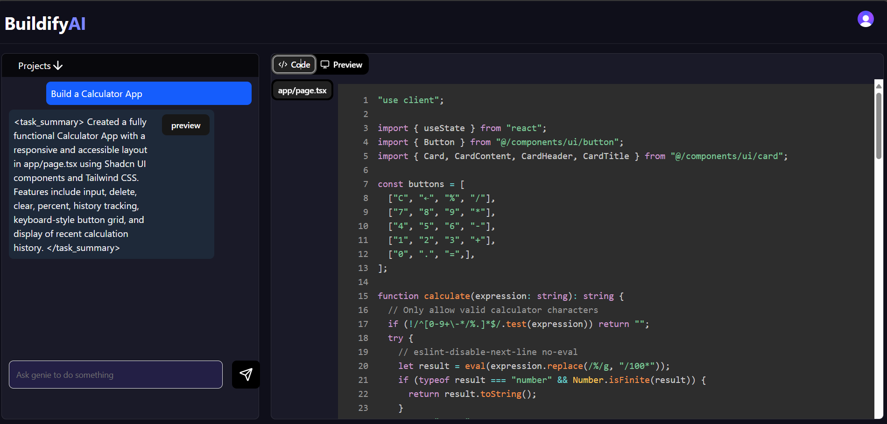
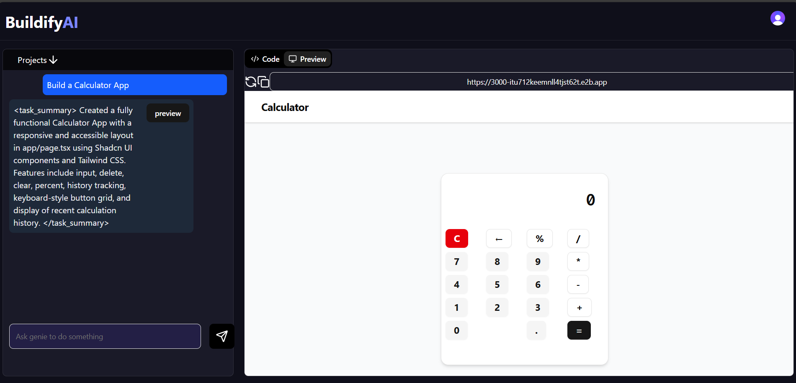

This is a [Next.js](https://nextjs.org) project bootstrapped with [`create-next-app`](https://nextjs.org/docs/app/api-reference/cli/create-next-app).
# AI B Project

# Project Title

🚀 Buildify AI

Buildify AI is a smart platform that helps creators, founders, and developers quickly build, prototype, and launch AI-powered apps without deep technical expertise.

Whether you're starting a SaaS, testing an idea, or automating workflows, Buildify AI gives you the tools to move from idea → product fast.


## ✨ Features

🛠️ No-code/low-code app builder – drag, drop, and deploy AI features.

🤖 AI integrations – connect with OpenAI, Hugging Face, and custom ML models.

📊 Analytics dashboard – track app performance and user behavior.

⚡ Instant deployment – one-click publish to web.

🔒 Secure & scalable – built with modern frameworks and cloud-native architecture.

## Usage Example



## Getting Started

First, run the development server:

```bash
npm run dev
# or
yarn dev
# or
pnpm dev
# or
bun dev
```

Open [http://localhost:3000](http://localhost:3000) with your browser to see the result.

You can start editing the page by modifying `app/page.tsx`. The page auto-updates as you edit the file.

This project uses [`next/font`](https://nextjs.org/docs/app/building-your-application/optimizing/fonts) to automatically optimize and load [Geist](https://vercel.com/font), a new font family for Vercel.

## Learn More

To learn more about Next.js, take a look at the following resources:

- [Next.js Documentation](https://nextjs.org/docs) - learn about Next.js features and API.
- [Learn Next.js](https://nextjs.org/learn) - an interactive Next.js tutorial.

You can check out [the Next.js GitHub repository](https://github.com/vercel/next.js) - your feedback and contributions are welcome!

## Deploy on Vercel

The easiest way to deploy your Next.js app is to use the [Vercel Platform](https://vercel.com/new?utm_medium=default-template&filter=next.js&utm_source=create-next-app&utm_campaign=create-next-app-readme) from the creators of Next.js.

Check out our [Next.js deployment documentation](https://nextjs.org/docs/app/building-your-application/deploying) for more details.


